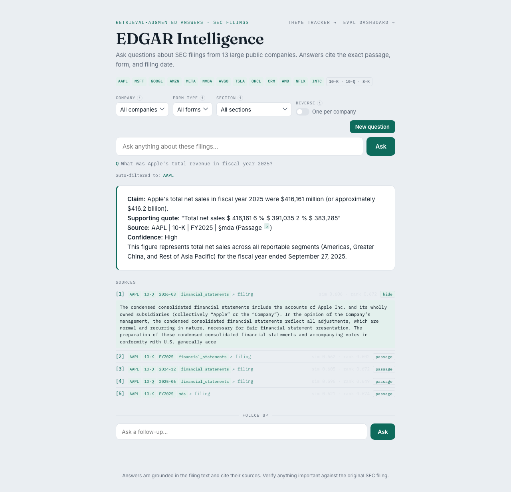
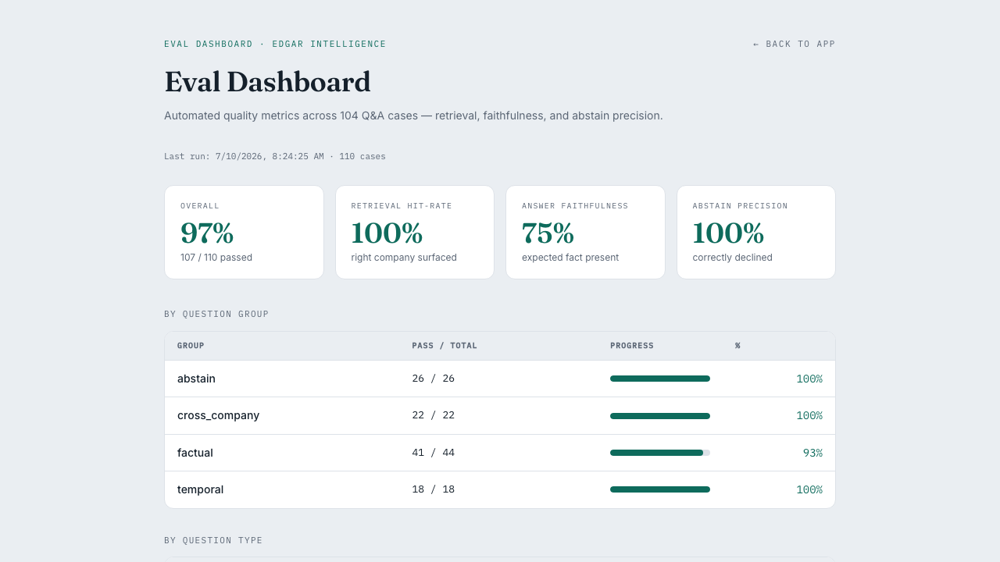

# EDGAR Intelligence (v4)

[](https://github.com/yalexie1/edgar-intelligence/actions/workflows/tests.yml)

Ask plain-English questions about SEC filings from 13 large public companies and get grounded, cited answers — built with retrieval-augmented generation (RAG).

Try at: https://edgar-intelligence.vercel.app/

NOTE: The backend is hosted on Render and spins down every 15 minutes when there's no activity. Please give up to 30-60 seconds for the backend to reboot if you're accessing the site for the first time.





## What it does

- Searches 8,141 embedded chunks from 10-K, 10-Q, and 8-K filings across AAPL, MSFT, GOOGL, AMZN, META, NVDA, AVGO, TSLA, ORCL, CRM, AMD, NFLX, and INTC
- Answers stream token-by-token via Server-Sent Events instead of waiting for the full response
- Every answer cites the exact passage, filing form, period, section, and a link to the original SEC document — each citation expands inline to show the actual cited text
- Filter by company, form type, and section (MD&A, Risk Factors, Financial Statements, and 4 others)
- Follow-up questions carry conversation context — ask "what was Apple's revenue?" then "how did management explain the growth?" and it stays focused
- Auto-detects company names in questions and applies the right metadata filter automatically
- Cross-company questions ("compare AAPL and MSFT cloud margins") retrieve evidence per-ticker separately so every named company is guaranteed representation
- Trend questions ("how has NVDA's gross margin changed?") retrieve across multiple filing periods and present results chronologically
- "What changed" questions ("what changed in NVIDIA's risk factors since last year?") retrieve the same section from two consecutive filing periods and generate a structured added/removed/unchanged comparison (defaults to Risk Factors if no section is named)
- A Cohere cross-encoder reranks the top-50 retrieved candidates for precision before an answer is generated (falls back to local cosine+lexical ranking if unset)
- Abstains honestly when the corpus doesn't cover the question

## Architecture

```
ingest.py          →  data/corpus.jsonl   →  embed_and_search.py  →  Pinecone (cloud)
(offline, frozen)      (chunked filings)      (embedding + upload)

ask.py  ←→  api.py  (FastAPI, Render)  ←→  index.html     (chat UI)
                                        ←→  dashboard.html  (eval metrics)
                                        ←→  themes.html     (theme tracker)
```

- **Embeddings**: OpenAI `text-embedding-3-small` (1536-dim)
- **Answers**: Anthropic Claude (`claude-sonnet-4-6` on Render; `claude-haiku-4-5-20251001` as dev default), streamed via SSE
- **Vector store**: Pinecone serverless (AWS us-east-1, cosine, free tier)
- **Retrieval**: Pinecone ANN (top-50 recall) → Cohere `rerank-v3.5` cross-encoder (precision) → structured per-entity retrieval for cross-company, temporal, and section-diff questions

## Setup

Requires Python 3.9+ (developed and tested on 3.14). The optional RAGAS eval layer needed a compatibility patch for a `nest_asyncio`/`asyncio.current_task()` incompatibility — the patch lives inside `evals/eval_ragas.py` itself, no particular Python version required.

Clone the repository and install dependencies:

```bash
git clone https://github.com/yalexie1/edgar-intelligence.git
cd edgar-intelligence
python -m venv .venv
source .venv/bin/activate
pip install -r requirements.txt
```

Create a local `.env` file with your API keys:

```bash
cp .env.example .env
```

Fill in your keys:

```env
OPENAI_API_KEY=your_openai_api_key
ANTHROPIC_API_KEY=your_anthropic_api_key
PINECONE_API_KEY=your_pinecone_api_key
COHERE_API_KEY=your_cohere_api_key
```

`COHERE_API_KEY` is optional (free tier: 1000 calls/month) — cross-encoder reranking is skipped and falls back to local cosine+lexical ranking if unset.

The vector index lives in Pinecone (cloud). The processed corpus is included at `data/corpus.jsonl`. To upload vectors to your own Pinecone index (creates the `sec-filings` index on first run):

```bash
python embed_and_search.py --rebuild
```

This costs roughly $0.03 in OpenAI embedding fees and only needs to run once. Subsequent runs skip the upload:

```bash
python embed_and_search.py
# Index already built (8141 vectors). Skipping embedding.
```

To run the API locally:

```bash
uvicorn api:app --reload --port 8000
```

Then open the frontend via a local server (not `file://`, so CORS works):

```bash
python -m http.server 5500
# open http://localhost:5500/index.html
```

## Running

```bash
# 1. Start the API server
source .venv/bin/activate
uvicorn api:app --reload --port 8000

# 2. Serve the frontend
python -m http.server 5500
# open http://localhost:5500/index.html
# open http://localhost:5500/dashboard.html
# open http://localhost:5500/themes.html
```

The API exposes:
- `POST /query` — answer a question with cited sources (rate-limited: 10/min, 200/day per IP)
- `POST /query/stream` — same answer, streamed token-by-token as Server-Sent Events
- `GET /themes?ticker=NVDA` — retrieval-only theme heat map (no LLM cost)
- `GET /health` — liveness check
- `GET /evals/results` — last eval run (used by the dashboard)
- `GET /evals/ragas` — last RAGAS run, if any (used by the dashboard)
- `GET /docs` — interactive API docs (FastAPI auto-generated)

## Eval harness

Two complementary evaluation layers. The deterministic suite is the primary regression test; RAGAS is a secondary LLM-judge layer.

### Layer 1 — Deterministic suite (primary)

A 110-case golden dataset (`evals/dataset.json`) covers four question types:

| Group | Cases | What it tests |
|---|---|---|
| factual | 44 | Single-lookup facts (revenue figures, product descriptions) |
| temporal | 18 | Multi-period synthesis (trend questions, min 2–3 unique periods) — includes 6 section-diff ("what changed") cases |
| cross_company | 22 | Per-company structured retrieval (2- and 3-company comparisons) |
| abstain | 26 | Out-of-corpus questions (should refuse to answer) |

Run the full suite (requires the API to be running):

```bash
python evals/eval.py
```

**Answer faithfulness** is scored only on cases with expected strings in `answer_contains` (12 cases). Cases without expected strings — including all 6 section-diff cases, since diff wording is non-deterministic — are retrieval-only checks and excluded from the faithfulness denominator.

Last result: **107/110 (97%)** — retrieval 100%, abstain precision 100%, cross-company 100%, temporal 100% (18/18). The 3 misses are known retrieval-precision gaps (see Known Limitations below), not routing bugs.  
Results are saved to `evals/last_results.json` and visible at `dashboard.html`.

### Layer 2 — RAGAS (complementary, optional)

RAGAS computes four LLM-as-a-judge metrics: faithfulness, answer relevancy, context precision, and context recall (the dashboard explains each one in plain English, including what a high score does and doesn't mean). Scores complement the deterministic suite but are not ground truth — they vary by judge model and version.

Requires extra dependencies:

```bash
pip install "ragas>=0.1.9" datasets pandas
```

Run a 10-case smoke test first, then the full set:

```bash
python evals/eval_ragas.py --subset 10
python evals/eval_ragas.py
```

**Headline scores are scoped to the `factual` question group (44/110 cases)** — the only group matching RAGAS's assumption of a single question answered from a single retrieval pass. Last real run (2026-07-22): faithfulness 0.912, answer relevancy 0.692, context precision 0.550, context recall 0.524. `abstain` cases are supposed to retrieve weak evidence and answer "the filings don't cover this," which these metrics score as failure rather than correct behavior; `cross_company`/`temporal` cases deliberately retrieve chunks spanning multiple companies or periods, which a per-chunk relevance judge can't distinguish from noise. All four groups' real scores are still shown — nothing is hidden — in the dashboard's expandable "full breakdown by question group" table, and in `evals/results/ragas_summary.json`'s `metrics_by_group` field. Use `python evals/eval_ragas.py --recompute-only` to rebuild the summary/CSV from an already-saved run's per-case scores with no new API calls.

Results are saved to `evals/results/` and shown in the eval dashboard under "RAGAS metrics."

### Unit tests

Pure-function tests — no network or paid API calls:

```bash
python -m pytest tests/
# 152 passed
```

Covers `canonical_section`, `build_where`, `diversify_results`, `detect_tickers`, `chunk_section`, and `_route` (the retrieval-strategy router shared by the blocking and streaming answer paths, including cross-company, temporal, and section-diff routing), plus the load-testing harness's pure functions (`tests/test_bench.py`) and the RAGAS async-compatibility patch and score-aggregation logic (`tests/test_eval_ragas.py`, skipped automatically if ragas/datasets/pandas aren't installed).

## Theme tracker

`themes.html` shows how strongly 8 predefined themes (AI/ML, Cybersecurity, Supply Chain, Regulation, China/Geopolitics, Climate/ESG, Competition, Cloud/Platform) appear in a company's filings across reporting periods. Scores are cosine + lexical rerank values — not frequency counts or sentiment. Retrieval-only, no LLM cost.

## Known limitations

- **Cross-company superlative questions** ("which company has the highest margin?") use broad retrieval rather than guaranteed per-ticker retrieval, so a company's strongest passage may not surface among the top candidates. Named comparisons ("compare AAPL and MSFT margins") use structured per-ticker retrieval and do guarantee coverage.
- **"What changed" section-diff questions** rely on a fixed phrase list to detect intent and default to Risk Factors when no section is named — a differently-worded or unrelated-sounding follow-up can miss the list or diff the wrong section. There's no dedicated UI toggle for this mode yet; it's reachable only by phrasing the question the way the router expects.
- **The section filter**, combined with a low-coverage ticker (INTC has only 22 chunks) or an uncommon section, can return thin or empty results without a clear signal why.
- **INTC** has far fewer chunks than the other 12 companies because its XBRL-inline 10-K HTML produces very few extractable text blocks.
- **Reranking weights** (the cosine + lexical boost formula, and use of the Cohere cross-encoder) are hardcoded heuristics, not tuned against the eval set.
- **Cold starts**: the Render free-tier backend spins down after ~15 min idle; the first request after that takes 15–30s even with streaming.
- **RAGAS** (the optional LLM-judge eval layer): a full 110-case run legitimately hits OpenAI rate limits/timeouts on a handful of judge calls, so `faithfulness`/`context_recall` are means over slightly fewer than 110 cases (surfaced in the dashboard as "N scored"). Its headline metrics are also intentionally scoped to the `factual` question group — see the Eval harness section above for why the other three groups (abstain, cross_company, temporal) don't fit RAGAS's scoring assumptions.
- **Rate limiting and CORS** protect against casual abuse, not a determined attacker with rotating IPs.
- One known eval miss: `avgo_gross_margin` — retrieval surfaces a restructuring 8-K chunk instead of the margin table, and the model correctly abstains rather than guessing.

## Notes

- `.env` holds secret keys and is gitignored. Never commit it.
- Every SEC EDGAR request sends a `User-Agent` header (name + email, required by SEC policy).
- `ingest.py` is frozen — do not modify unless you intend to rebuild the full corpus from scratch.
- The public endpoint has per-IP rate limiting (10 req/min, 200 req/day) and a global daily cap (2000 req/day).

## License

MIT — see [LICENSE](LICENSE).
